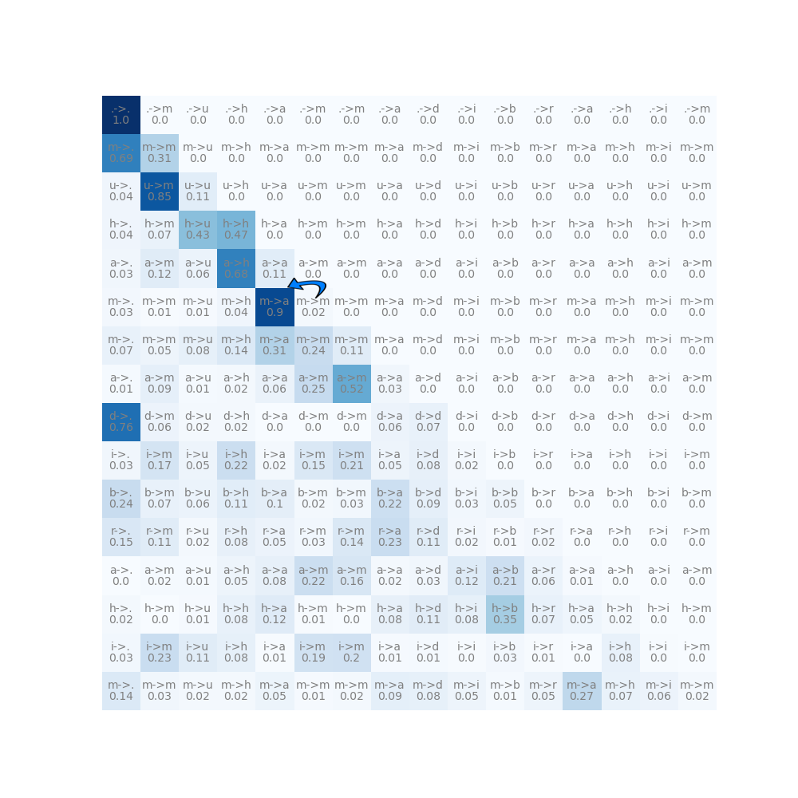

# Model

This repo contains a Jupyter Notebook that implements an auto regressive char level Language Model, with a transformer decoder nn. 
The code is super hacky and i am not proud of it currently.

It trains on `names.txt` dataset, as an example, taken from [ssa.gov](https://www.ssa.gov/oact/babynames/)
```
emma
olivia
ava
isabella
sophia
charlotte
...
```
At inference it generates name-like sequences as:
```
mackinley.
channer.
syrina.
corryna.
avygrian.
genarice.
aurieli.
margaretha.
...
```

# Attention

With this repo i intend to visualize and understand the attention mechanism used to derive the ouput distributions.

For example i hereby display the attention maps of the head 0 and head 2, of the first layer in the transformer.
The maps are retrieved while forwarding the name ".muhamadibrahim."

{char1} -> {char2} cell denotes that char1 will aggregate "that much" contextual info from char2 in the output of the layer. At least at the first layer(see below).




We observe that the different heads contain entirely different information. For example head0 "attends" to more "global" info, unlike head2 that focuses on a more "local" 
radius to contextually represent each token in it's output.

But to what extent is this enough to interpret the model?

The following are considered: 

1. While in the first layer we can say that these attention probabilities refer to the input characters themselves,
   in higher layers this is not true as the different tokens have aggregated info from different characters.
2. Additionaly we cannot base our interpretations in the attention maps individually as we need to account for the whole model (ffnn, skip connections, etc.),
   in order to retreive a global explanation of the output probabilities.

Explainability algos to be implemented.


